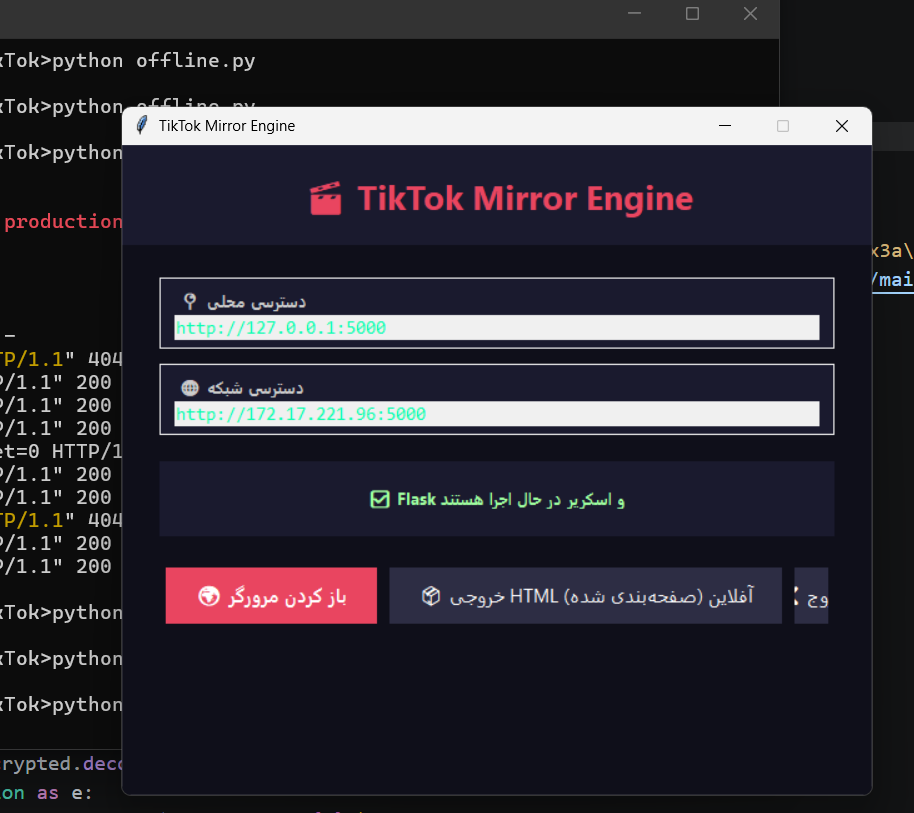
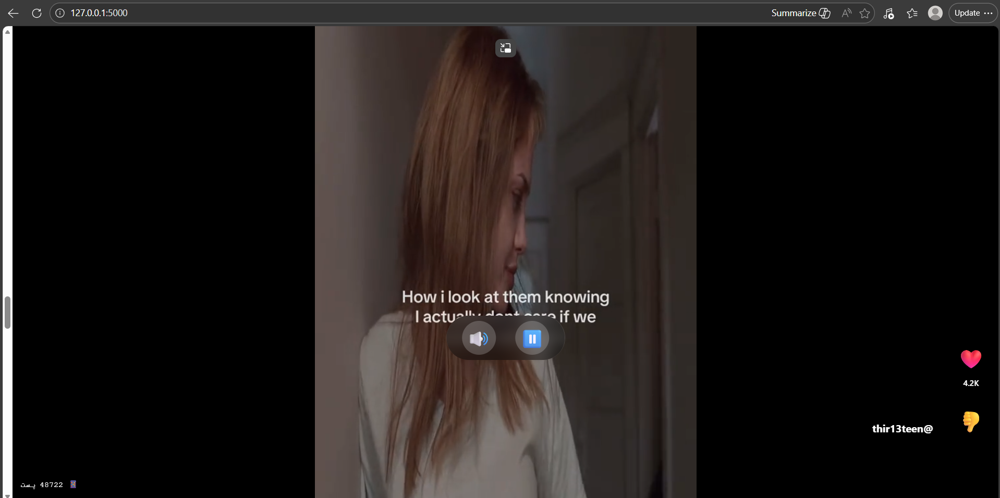

# TikTok-Mirror
پروژه ای متن باز و رایگان با لایسنس MIT که با استفاده از زیرساخت های ایرانی دسترسی به محتوای تیک تاک را به صورت آینه ای ممکن می سازد
---

## 📸 Screenshot





---

# نحوه استفاده (گرافیکی است)
در صفحه باز شده این اطلاعات نمایش داده می شود:
> وضعیت فعلی مثلا در حال اجرا است...
>  لینک برای دسترسی محلی معمولا 127.0.0.1:5000
> لینک برای دسترسی افراد در یک مودم مثلا : 10.218.220.1:5000
> دکمه باز کردن در مرورگر
> دکمه ساخت خروجی html
>  خروجی
```
python main.py
```


---


# ساخت نسخه آفلاین
می توانید نسخه .html آفلاین(با اینترانت ایرن کار می کند) و بدون نیاز به vpn یا پایتون ایجاد کنید و روی هر دستگاهی اجرا کنید
```
python offline.py
# chose your dir and .html file name
```
ا[ینجا از قبل یه خروجی با 50,000x پست ساخته و قابل دانلود هست](https://github.com/mr-r0ot/TikTok-Mirror/releases/tag/new-offline-html) 

# خزنده ها
این فایل در mirror ها می خزند و اطلاعات را بروز نگه می دارند یا در صورت افزودن آینه جدید تمام محتوای آینه را می گیرند و در posts.json ذخیره می کنند و همچنین آخرین دیتا دریافتی در channel.json ثبت می شود
```
# Get full data of all mirrors
python scraper.py --full

# Just update and check for new posts
python scraper.py
```

# اجرا کننده ها
این فایل محتوای posts.json را با index.html در شبکه میزبانی می کند
```
python app.py
```

---

به صورت کلی مرورگر chrome پیشنهاد می شود بعضی ویدیو ها ممکن است در firefox و... باز نشود

# روش کار کلی
سیستم ها وافراد ویدیو های دریافت شده از تیک تاک را در زیرساخت سوروش پلاس آپلود می کنند و می توانیم بدون نیاز به لاگین در سرورش پلاس به آن محتوای تیک تاک دسترسی داشته باشیم به این کانال ها mirror می گوییم و در mirrors.txt قابل مشاهده است

# الگوریتم پیشنهاد دهنده پست ها
با js در نسخه آفلاین و با app.py در نسخه میزبانی شده یه الگوریتم پیشنهاد دهنده وجود دارد که بر اساس لایک یا دیسلایک ها الویت نمایش یک آینه را مشخص می کند

# اسکرول بی نهایت
اسککرول بی نهایت همراه با الویت دیده نشده ها + الویت نمایش یک آینه بر اساس لایک/دیس لایک وجود دارد

# پایداری
در قطع کامل اینترنت با اینترانت ایران همچنان کار می کند و سرعت لود نیز وابسته به زیر ساخت سرورش پلاس است

# محدودیت ها
 کاربر فقط گیرنده است و امکان بارگذاری یا ارتباط مستقیم با تیک تاک را ندارد همچنین تعداد پست ها محدود به پست های آینه ها و خزنده است

